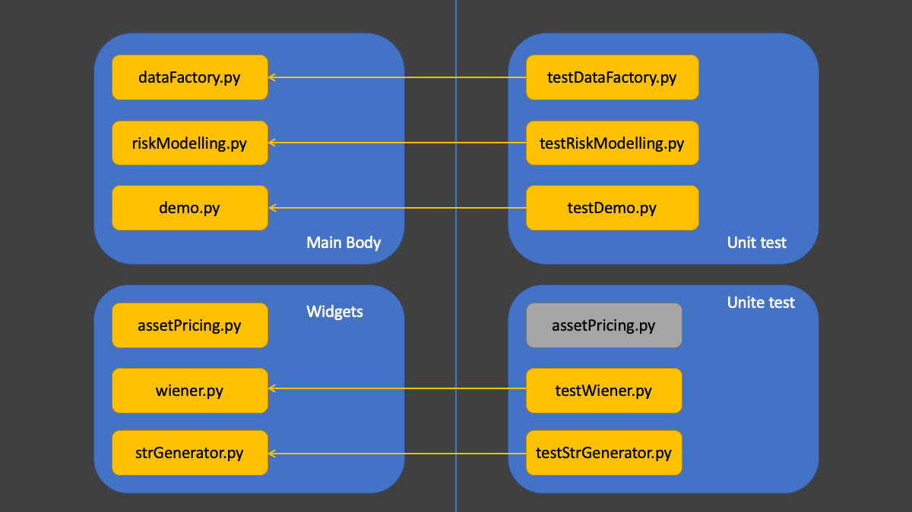

# Project
This model supports the calculation of VaR (value at risk) and ES (expected shortfall) of any given number of stocks (identified with their tickers) and the portfolio as a whole, based on 3 main methods: 
- **Parametric Method:** VaR and ES are directly calculated with closed form equations. 
- **Monte Carlo simulations:** VaR and ES are calculated based on simulated projected results. 

----

# Features
## Arbitrary Stock Ticker Input
When you first started to run the program, you will be asked to input the tickers of stocks you are interested in. For example, 'AAPL' for Apple. 
These stocks need to be currently publicly traded to make sure that data would be successfully fetched from Yahoo finance. 
## Graphical Comparison
Functions in [demo.py](./demo.py) would allow users to compare the impact of different estimation methods, or window periods, or positions on the final evaluation of VaR and ES. 
## Customization
All functions are publicly accessible to users. You might tailer the functions or combine them as you need. 

----

# Installation
To run this project, you need to install the following packages: 
- pandas: https://pandas.pydata.org
- numpy: https://numpy.org
- scipy: https://scipy.org
- yfinance: https://pypi.org/project/yfinance/

----

# Specifications
- We would recommend running this model in [Model.py](./Model.ipynb), in which you would have an interative experience with one single dataframe. 
- Pre-determined values in [Model.py](./Model.ipynb) could be tailored to your need. In this model, specifically, we set:  
    - Estimation window for GBM parameters to be: 2 years, 5 years and 10 years. 
    - Equivalent lambda's for exponential weighting methods to be: 0.9972531953, 0.9989003714 and 0.9994500345 **(they are specific for the windowList mentioned above. If you were to change windowList, you should change lambdaList respectively)**
    - Probability parameters for VaR and ES to be: 95%, 97.5% and 99%
    - Time interval for VaR and ES to be: 5 days, 10 days and 30 days
    - Initial fund to be: $100000
-Monte Carlo Simulations
    - All Monte Carlo simulations have default number of trials set as 1000. User can change them accordingly with parameters 'trials' or 'numberOfTrials'. 

----

# Software Limitations
- Historical
  - Historical VaR and ES only allows for long position. 
  - Historical method is based on relative changes. 

- Monte Carlo simulations
  - When conducting Monte Carlo simulations with the portfolio, assuming underlying stocks follow GBM, this model only supports portfolio consisting of 2 stocks, as covariance would be a number, which could be easily stored in dataframe. 

- Option related
  - The method to bring down VaR with put option only support long position. 
  - The method to bring down VaR with put option consumes a lot of computing power and an acceptable tolerance (which is also the default value) is 0.01, which is 1%. In other words, this model would only give you results like 'liquidate 2% of your portfolio and buy put options to decrease VaR'
  - The target of VaR is 80% of its original value. 
  - Interest rate is assumed to be 0.5% all the time. 
  - implied volatility is assumed to be constant all the time. 

- Others
  - Only the last 25 years of data is reserved to improve model efficiency. 
  - [assetPricing.py](./assetPricing.py) only deal with European style options. No early exercise is allowed. 
  - [demo.py](./demo.py) can only compare VaR and ES in saperate plots. It's usual the case that we would like to compare VaR and its corresponding ES, say, 99% VaR and 97.5% ES. 
  - When comparing results from 3 methods using PARAM_MC_HIST from [demo.py](./demo.py), window version is adopted to represent parametric results. 

----

# Example
A detailed and interactive example could be found in [Model.py](./Model.ipynb). 

----

# Attention
Because Monte Carlo simulations could consume a large amount of computing power, unlike historical and parametrical VaR and ES (they are computed in advance and ready-to-use), estimation of VaR and ES based on simulations would operate in a call-and-calculate manner. 

----

# Contribution
This project and the corresponding model is accomplished by Yanjie Liu, Qingyi Yan and Ming Yin, students of Math GR5320, Fall 2021 at Columbia University. 

----

# General Structure

----

# Function Documentation
## [strGenerator.py](./strGenerator.py)

**This file generates column labels of the main dataframe. **

### *strGenerator.paramStrGenerator(ticker, parameter, window = '', method = '')*
A function that generates parameter labels, which will be used as DataFrame column names. 

#### Parameters: 
**ticker:** stock ticker  
**parameter:** parameter name (mu, sigma, logRtn, num, etc,.)  
**window:** length of historical window period (2, 5, 10. In years)  
**method:** estimation method ('window' or 'exp')  

#### Returns: 
A string with all the information aggregated from input. 

#### Examples: 
'AAPL_num', 'MSFT_mu_2y_exp', 'TSLA_sigma_10y_window'  

----

### *strGenerator.riskStrGenerator(bigType, ticker, p, t, riskType, estWindow, estMethod = None, position = None)*
A function that generate label for VaR and ES. 
    
#### Parameters: 
**bigType:** 'MC' or 'PARAM' or 'HIST'  
**ticker:** stock ticker  
**p:** percentile to compute VaR or ES (99%ES: p = 0.99)  
**t:** period of time to look ahead (e.g. 5d VaR), in days  
**riskType:** 'VaR' or 'ES'  
**estWindow:** the length of historical window that estimation was based on (in years)  
**estMethod:** 'window' or 'exp'  
**position:** 'long' or 'short'  
    
#### Returns: 
A string that represent the label of the specified risk parameter. 
    
#### Examples: 
AAPL_0.99_5dVaR_5y_window_short  
MSFT_0.975_10dES_10y_exp_long (exp method does not have estWindow)  

----

## [dataFactory.py](./dataFactory.py)

**This file interacts with user and [riskModelling.py](./riskModelling.py). It feeds necessary parameters to [riskModelling.py](./riskModelling.py) and organize data into the dataframe. **

### *dataFactory.readTickerList()*
A function that reads stock tickers from users.  

#### Parameters: 
None

#### Returns: 
A list of string which corresponds to the ticker of each stock.  

### *dataFactory.readNumList(tickerList)*
A function that reads number of stocks to buy from users. 

#### Parameters: 
tickerList: list of string which corresponds to the ticker of each stock. 

#### Returns: 
A list of integers which corresponds to the number of shares of each stock.  

----

### *dataFactory.positionCalc(df, tickerList, numList)*
A function that add columns with number of shares of each stock to original dataframe. 

#### Parameters: 
**df:** original DataFrame object with price data in columns labeled with ticker  
**tickerList:** list of string that corresponds to the ticker of each stock  
**numList:** number of shares that corresponds to the ticker of each stock  

#### Returns:
None

----

### *dataFactory.portfolioCalc(df, tickerList, numList)*
A function that add portfolio value as a new column to original dataframe. 

#### Parameters: 
**df:** original DataFrame object with price data in columns labeled with ticker  
**tickerList:** list of string that corresponds to the ticker of each stock  
**numList:** number of shares that corresponds to the ticker of each stock  

#### Returns: 
None

----

### *dataFactory.dwnloadAndJoin(tickerList)*
A function that downloads data using yfinance (yahoo finance) and join data of different stocks into one single dataframe. 

#### Parameters: 
tickerList: list of string that corresponds to tickers of stocks to be observed. 
#### Returns: 
A pandas.DataFrame consisting of all data of all stocks. 

----

### *dataFactory.logRtnCalc(df, ticker, lag)*
A function that calculates log return given the ticker of the stock and time interval. 

#### Parameters: 
**df:** pandas.DataFrame  
**ticker:** stock ticker  
**lag:** 'lag'-day log return  

#### Returns: 
None

----

### *dataFactory.gbmParamCalc(df, ticker, window, method, lam = None)*
A function that calculates the estimated mu and sigma for GBM. 
This function supports both window and exponential weighting methods. 

#### Parameters: 
**df:** original DataFrame object  
**ticker:** stock ticker  
**window:** window period in years (2, 5 or 10)  
**method:** estimation method ('window' or 'exp')  
**lam:** Equivalent lambda, only used for 'exp' type estimation  

#### Returns: 
None. Changes are made to original dataframe. 

----

### *dataFactory.PARAMriskCalc(df, v0, ticker, p, t, estWindow, riskType = 'VaR', estMethod = 'window', position = 'long')*
Generate new columns in original DataFrame which calculates parametric VaR/ES. 
    
#### Parameters: 
**df:** original df  
**ticker:** stock ticker  
**p:** percentile (example: 99% ES -> p = 0.99)  
**t:** period of time to look ahead (in years)  
**estWindow:** length of historical window of data to look back  
**riskType:** 'VaR' or 'ES'  
**estMethod:** 'window' or 'exp'  
**position:** the position you would like to take: 'long' or 'short'  
#### Returns: 
None. Changes are made to original dataframe. 

----

### *dataFactory.MCriskCalc(df, v0, ticker, p, t, estWindow, riskType = 'VaR', estMethod = 'window', position = 'long', trials = 1000)*
Generate new columns in original DataFrame which calculates VaR/ES based on Monte Carlo simulations
    
#### Parameters: 
**df:** original df  
**ticker:** stock ticker  
**p:** percentile (example: 99% ES -> p = 0.99)  
**t:** period of time to look ahead (in years)  
**estWindow:** length of historical window of data to look back  
**riskType:** 'VaR' or 'ES'  
**estMethod:** 'window' or 'exp'  
**position:** the position you would like to take: 'long' or 'short'  
**trials:** number of trials to conduct Monte Carlo simulations  
#### Returns: 
None. Changes are made to original dataframe.

----

### *dataFactory.HISTriskCalc(df, v0, ticker, p, t, estWindow)*
Generate new columns in original DataFrame which calculates VaR/ES based on Monte Carlo simulations
    
#### Parameters: 
**df:** original df  
**ticker:** stock ticker  
**p:** percentile (example: 99% ES -> p = 0.99)  
**t:** period of time to look ahead (in years)  
**estWindow:** length of historical window of data to look back 
**riskType:** 'VaR' or 'ES'  
#### Returns: 
None. Changes are made to original dataframe.    

----

### *dataFactory.conditionalMean(df, p)*
Calculate the mean of data that rank within (1-p)th quantile of the entire series. 

#### Parameters: 
**df:** One-column dataframe
**p:** quantile (must be within (0, 1))
#### Returns: 
The conditional mean of data lying within (1-p)th quantile of df. 

----

### *targetLiquidate(df, ticker, v0, p, t, iv)*
Calculate the proportion of v0 (originally 100% in stock/portfolio) to be liquidated to buy put option in order to decrease VaR by 20%. 

#### Parameters: 
**df:** the original DataFrame containing stock price and VaR  
**ticker:** the ticker of the stock you would like to observe  
**v0:** initial fund  
**p:** quantile (must be within (0, 1)) for VaR (99% VaR -> p = 0.99)  
**t:** time horizon of VaR (5d VaR -> t = 5)  
**iv:** implied volatility  

#### Returns: 
None

----

### *rhoCalc(df, tickerList)*
This function calculate the correlation coefficient of two stocks based on rolling window of length 5 years. 

#### Parameters: 
**df:** the original DataFrame with daily log return of individual stocks  
**tickerList:** a list of tickers of stocks. Must be of length 3 with ticker 'portfolio' included 

#### Returns: 
None

----

### *MCriskCalc_corr(df, tickerList, p, t, estWindow, riskType = 'VaR', estMethod = 'window', trials = 1000, v0 = 100000)*

This function calculates VaR or ES of the portfolio assuming underlying correlated stocks follow GBM, based on Monte Carlo simulations. 

#### Parameters: 
**df:** the original DataFrame containing stock price and VaR  
**tickerList:** a list of tickers of stocks. (ticker 'portfolio' must be inside this list)  
**p:** quantile (must be within (0, 1)) for VaR (99% VaR -> p = 0.99)  
**t:** time horizon of VaR (5d VaR -> t = 5 / 252)  
**estWindow:** length of window which corresponds to the parameters (mu, sigma)  
**riskType:** 'VaR' or 'ES'  
**estMethod:** 'window' or 'exp'  
**trials:** number of trials to conduct Monte Carlo simulations. 1000 by default  
**v0:** initial fund. 100000 by default   

#### Returns: 
None

----        

## [riskModelling.py](./riskModelling.py)

**This file deal with calculation of VaR and ES with different methods (historical, parametric and Monte Carlo simulations). No dataframe is involved. **

### *riskModelling.gbmVaR(v0, mu, sigma, p, t, position = 'long')*
Calculate VaR of a single stock following GBM. 
This function supports long and short position. 

#### Parameters: 
**v0:** initial portfolio value  
**mu:** drift  
**sigma:** volatility  
**p:** percentile to calculate VaR (Must be within (0, 1).  Example: 99% VaR: p = 0.99)  
**t:** period of time to look ahead (in years. Example: 5 days -> t = 5/252)  
**position:** string 'long' or 'short'. 'long' by default  

#### Returns: 
A double value of VaR corresponding to that stock. 

----

### *riskModelling.gbmES(v0, mu, sigma, p, t, position = 'long')*
Calculate expected shortfall of a single stock following GBM. 
This function supports both long and short positions. 

### Parameters: 
**v0:** initial portfolio value  
**mu:** drift  
**sigma:** volatility  
**p:** percentile to calculate VaR (Must be within (0, 1).  Example: 99% ES: p = 0.99)  
**t:** period of time to look ahead (in years. Example: 5 days -> t = 5/252)  
**position:** string 'long' or 'short'. 'long' by default  

#### Returns: 
A double value of ES corresponding to that stock. 

----
        
### *riskModelling.parametricVaR(a, s, mu, sigma, covm, p, t, position = 'long')*
Compute the VaR of a portfolio of stocks that follows correlated GBMs by assuming
that the portfolio is normally distributted. 

#### Parameters: 
**a:** position vector (number of shares of each stock)  
**s:** initial stock price   
**mu:** drift vector  
**sigma:** volatility vector  
**covm:** covariance matrix  
**p:** percentile to calculate VaR (99% VaR: p = 0.99)  
**t:** period of time to look ahead (in years)  
**position:** string 'long' or 'short'. 'long' by default  

#### Returns: 
A double value which represents value at risk. 

----

### *riskModelling.parametricES(a, s, mu, sigma, covm, p, t, position = 'long')*
Compute the ES of a portfolio of stocks that follows correlated GBMs by assuming
the portfolio is normally distributted. 

#### Parameters: 
**a:** position vector (number of shares of each stock)  
**s:** initial stock price   
**mu:** drift vector  
**sigma:** volatility vector  
**covm:** covariance matrix  
**p:** percentile to calculate VaR (99% ES: p = 0.99)  
**t:** period of time to look ahead (in years)  
**position:** string 'long' or 'short'. 'long' by default  

#### Returns: 
A double value which represents the expected shortfall. 

----

### *riskModelling.gbmPrice(s, mu, sigma, t, a = None, covm = None)*
Calculate projected future value of a portfolio/stock based on one sample path, 
assuming that it follows GBM. 

#### Parameters: 
**v0:** initial stock price  
**mu:** drift vector  
**sigma:** volatility vector  
**t:** time steps (in years)  

#### Returns: 
A double value which corresponds to the projected value in time t

----

### *riskModelling.MCVaR(s, v0, mu, sigma, p, t, trials = 1000, position = 'long')*
Use Monte-Carlo simulation to generate a set of paths following GBM. 
Use the projected price from sample paths to calculate value at risk. 

#### Parameters: 
**s:** initial stock price  
**mu:** drift  
**sigma:** volatility  
**p:** percentile (example: 99% VaR -> p = 0.99)  
**t:** time steps (in years)  
**trials:** number of trials for simulations. 1000 by default.   
**position:** string 'long' or 'short'. 'long' by default  

#### Returns: 
A double value which represents VaR based on simulations. 

----

### *riskModelling.MCES(s, v0, mu, sigma, p, t, a = None, covm = None, trials = 1000, position = 'long')*
Use Monte-Carlo simulation to generate a set of paths following GBM. 
Use the projected price from sample paths to calculate expected shortfall. 

#### Parameters: 
**s:** initial stock price   
**mu:** drift   
**sigma:** volatility   
**p:** percentile (example: 99% ES -> p = 0.99)  
**t:** time steps (in years)   
**trials:** number of trials for simulations. 1000 by default.   
**position:** string 'long' or 'short'. 'long' by default  

#### Returns: 
A double value which represents ES based on simulations. 

----

### *riskModelling.liquidateVaR_MC(v0, s0, mu, sigma, iv, dt, p, liquidate, r, trial = 1000)*
Returns VaR of portfolio given the weight of portfolio liquidated to buy put option. 
    
#### Parameters: 
**v0:** portfolio initial fund  
**s0:** stock price  
**mu:** drift parameter  
**sigma:** volatility parameter for GBM  
**iv:** implied volatility for option  
**dt:** time interval (in years)  
**p:** quantile for VaR e.g. 0.99 for 99% VaR  
**liquidate:** percentage of portfolio to be liquidated to buy put option  
**r:** interest rate  
**trial:** number of trials to run Monte Carlo simulation. 1000 by default  

#### Returns: 
A double value of VaR of the 'hybrid portfolio' based on Monte Carlo simulations

----

### *riskModelling.liquidateProportion(v0, s0, mu, sigma, iv, dt, p, r, targetVaR, left, right, e, trial = 1000)*
Returns the percentage of a portfolio to be liquidated to achieve target VaR
        
#### Parameters: 
**v0:** initial fund of portfolio  
**s0:** initial stock price  
**mu:** drift parameter for GBM  
**sigma:** volaitlity parameter for GBM  
**iv:** implied volatility  
**dt:** time interval (in years)  
**p:** quantile for VaR (0.99 for 99% VaR)  
**r:** risk free rate  
**targetVaR:** target VaR  
**left:** left starting point  
**right:** right starting point  
**e:** tolerence (0.001 if you want your result to be as acurate as 0.1%)  
**trial:** number of trials for each position. 1000 by default  

#### Returns: 
A double value in range [0, 1] which indicates the percentage to liquidate to buy put option  

----

### *MCVaR_corr(sigma1, sigma2, mu1, mu2, n1, n2, v1, v2, rho, dt, p, numberOfTrials = 1000, v0 = 100000)*
This function calculates the VaR of a portfolio consisting of 2 correlated stocks. 

#### Parameters: 
**sigma1:** volatility of stock 1  
**sigma2:** volatility of stock 2  
**mu1:** GBM mu parameter of stock 1  
**mu2:** GBM mu parameter of stock 2  
**n1:** number of shares of stock 1  
**n2:** number of shares of stock 2  
**v1:** current price of stock 1  
**v2:** current price of stock 2  
**rho:** correlation  
**dt:** time step (in years. 5 / 252 for 5 days)  
**p:** quantile (must be within (0, 1)) for VaR (99% VaR -> p = 0.99)  
**numberOfTrials:** total number of trials to conduct Monte Carlo simulations  
**v0:** initial fund  

#### Returns: 
A double value representing VaR of the portfolio based on Monte Carlo simulations.   

----

### *MCES_corr(sigma1, sigma2, mu1, mu2, n1, n2, v1, v2, rho, dt, p, numberOfTrials = 1000, v0 = 100000)*
This function calculates the ES of a portfolio consisting of 2 correlated stocks. 

#### Parameters: 
**sigma1:** volatility of stock 1  
**sigma2:** volatility of stock 2  
**mu1:** GBM mu parameter of stock 1  
**mu2:** GBM mu parameter of stock 2  
**n1:** number of shares of stock 1  
**n2:** number of shares of stock 2  
**v1:** current price of stock 1  
**v2:** current price of stock 2  
**rho:** correlation  
**dt:** time step (in years. 5 / 252 for 5 days)  
**p:** quantile (must be within (0, 1)) for VaR (99% VaR -> p = 0.99)  
**numberOfTrials:** total number of trials to conduct Monte Carlo simulations  
**v0:** initial fund  

#### Returns: 
A double value representing ES of the portfolio based on Monte Carlo simulations.  

----

## [demo.py](./demo.py)

**This file make comparison plots based on different estimation methods (window, equivalent lambda, historical, etc.,). **

### *demo.riskPlot(df, ax_obj, riskLabel)*
A function that plot a subsplot

#### Parameters:
**df:** original pandas.DataFrame object  
**ax_obj:** matplotlib.pyplot.axes object, which corresponds to one subplot of the main plot.   
**riskLabel:** the label (which is also column name) used to look up data  

#### Returns: 
matplotlib.pyplot.subplots

----

### *demo.fMethodDiffWinPlot(df, bigType, ticker, p, t, estWindowList, estMethod, position = 'long')*
A function that plots and compares different window length under the same estimation method. 
fMethodDiffWinPlot stands for 'fixed method different window. '

#### Parameters:
**df:** original pandas,DataFrame  
**bigType:** 'MC' or 'PARAM' or 'HIST'  
**ticker:** stock ticker  
**p:** percentile (example: 99% ES -> p = 0.99)  
**t:** period of time to look ahead (in years)  
**estWindowList:** a list of window length to be compared (example: [2, 5, 10])  
**estMethod:** 'window' or 'exp'  

#### Returns: 
A plot with VaR comparison at the top and ES comparison at the bottom. 

----

### *demo.fWinDiffMethodPlot(df, bigType, ticker, p, t, estWindow, position = 'long')*
Fixed window different methods. 
A function that compares different method ('window' and 'exp') based on the same historical window
(example: 2-y rolling window and 2-y equivalent lambda)

#### Parameters:
**df:** original pandas.DataFrame  
**bigType:** The main method (Monte Carlo, historical and parametric) used to calculate VaR and ES. Must be 'MC' or 'PARAM' or 'HIST'  
**ticker:** stock ticker  
**p:** percentile (Must be within (0, 1). Example: 99% ES -> p = 0.99)  
**t:** period of time to look ahead (in years)  
**estWindow:** length of historical window of data to look back  
**position:** 'long' or 'short'  

#### Returns: 
A plot with VaR comparison at the top and ES comparison at the bottom. 

----

### *demo.fWinFMethodDiffPosition(df, bigType, ticker, p, t, estWindow, estMethod)*
Fixed window, fixed method, different positions. 
A function that compares VaR and ES with different positions based on same historical window and estimation method. 

#### Parameters:
**df:** original pandas.DataFrame  
**bigType:** The main method (Monte Carlo, historical and parametric) used to calculate VaR and ES. Must be 'MC' or 'PARAM' or 'HIST'  
**ticker:** stock ticker  
**p:** percentile (Must be within (0, 1). Example: 99% ES -> p = 0.99)  
**t:** period of time to look ahead (in years)  
**estWindow:** length of historical window of data to look back  
**estMethod:** 'window' or 'exp'  

#### Returns: 
A plot with VaR comparison at the top and ES comparison at the bottom. 

----

### *demo.paramMC(df, ticker, p, t, estWindow, estMethod, position)*
A function that generates plots to compare VaR and ES from parametric method and Monte Carlo simulations. 
'Fixed window, fixed estimation method, fixed position'
    
#### Parameters:: 
**df:** original pandas.DataFrame  
**ticker:** stock ticker  
**p:** percentile (Must be within (0, 1). Example: 99% ES -> p = 0.99)  
**t:** period of time to look ahead (in years)  
**estWindow:** length of historical window of data to look back  
**estMethod:** 'window' or 'exp'  
**position:** 'long' or 'short'   

#### Returns: 
A plot with VaR comparison at the top and ES comparison at the bottom. 

----

### *demo.PARAM_MC_HIST(df, ticker, p, t, estWindow, position = 'long')*
A function that generates plots to compare VaR and ES from parametric method, Monte Carlo simulations and historical method. 
'Fixed window, fixed estimation method, long position'

#### Parameters:
**df:** original pandas.DataFrame  
**ticker:** stock ticker  
**p:** percentile (Must be within (0, 1). Example: 99% ES -> p = 0.99)  
**t:** period of time to look ahead (in years)  
**estWindow:** length of historical window of data to look back  
**position:** 'long' or 'short'   

#### Returns: 
A plot with VaR comparison at the top and ES comparison at the bottom.  

----

## [assetPricing.py](./assetPricing.py)

**This file deals with the pricing of an asset. In the current version, specifically, it deals calculates Eoropean option price. **

### *assetPricing.blackScholes(s, x, sigma, r, t, q = 0.0, optionType = 'c')*
A function that calculates European option price, given strike, current price, implied volatility, risk free rates, dividend rates and option type.   

#### Parameters: 
**s:** current spot price of the underlying asset  
**x:** strike price  
**sigma:** implied volatility (must be within greater than 0, 0.15 for 15%)  
**r:** risk free rate (0.01 for 1%)  
**t:** time to maturity, in years (5 / 252 for 5 days)  
**q:** dividend rate (0.1 for 10%)  
**optionType:** 'c' for call option, 'p' for put option  

#### Returns: 
A double value of current price of the specified option.  

----

## [wiener.py](./wiener.py)

**This file is responsible for generating wiener processes, both single wiener process and set of correlated wiener processes. **

### *class<wiener.wiener(length, covm)>*
A class which reads the length of correlated wiener processes and spit out a numpy.array() object of correlated wiener processes.  

#### Parameters: 
**length:** number of wiener processes to be generated. 1 by default  
**covm:** covariance matrix of the wiener processes. None by default  

----

